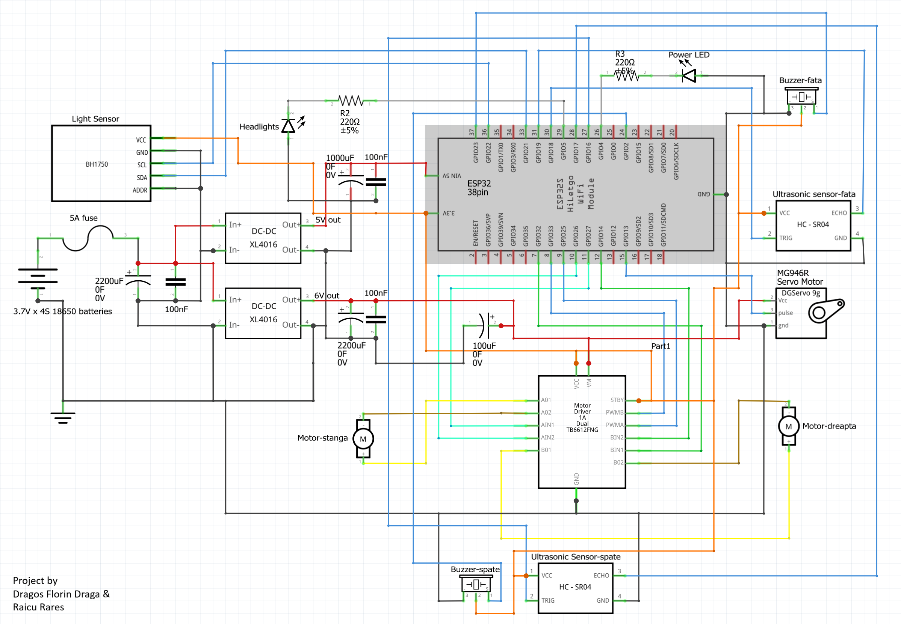

# RC Car Project

Proiect realizat în cadrul facultății ce constă într-o mașinuță RC controlată prin intermediul unui ESP32 și al unei interfețe web accesibile de pe telefon.

## DEMO

[RC-CAR](https://youtube.com/shorts/wE6PHsZGV6w)

[WebApp](https://www.youtube.com/shorts/Gxu313YEjeU)

## Funcționalități

- Control prin Wi-Fi folosind ESP32 în modul Access Point.
- Interfață web pentru controlul direcției și vitezei.
- Control cu joystick sau butoane.
- Servo pentru direcție.
- Motoare DC controlate prin driver.
- Senzori ultrasonici față și spate pentru detectarea obstacolelor.
- Buzzere pentru avertizare în funcție de distanță cu buton pentru dezactivare sunet.
- Senzor de lumină BH1750.
- Aprinderea automată sau manuală a farurilor.
- Oprire automată în cazul pierderii conexiunii.

## Componente utilizate

- ESP32
- Driver motoare TB6612FNG
- 2 × Motoare DC N20 6V 500rpm
- Servomotor MG946R
- 2 × Senzor ultrasonic HC-SR04
- 2 × Buzzere
- Senzor de lumină BH1750
- 8 x LED-uri
- Alimentare cu 4 x baterii 18650
- 2 x Buck convertor step-down DC-DC
- Switch
- Rezistente, Condensatori, Siguranta.

## Schema proiectului

Schema de conectare este prezentată mai jos.

## Structura proiectului

- `RC-Car-Proiect.ino` – codul principal pentru ESP32.
- `schema_electrica.png` – schema electrică a proiectului.

## Cum se utilizează

1. Se încarcă programul pe ESP32.
2. ESP32 creează rețeaua Wi-Fi **ESP32_RC_CAR**.
3. Telefonul se conectează la această rețea.
4. Se accesează adresa **192.168.4.1** din browser.
5. Mașinuța poate fi controlată din interfața web.

## Autori
- Dragos Florin Draga
- Raicu Rares
